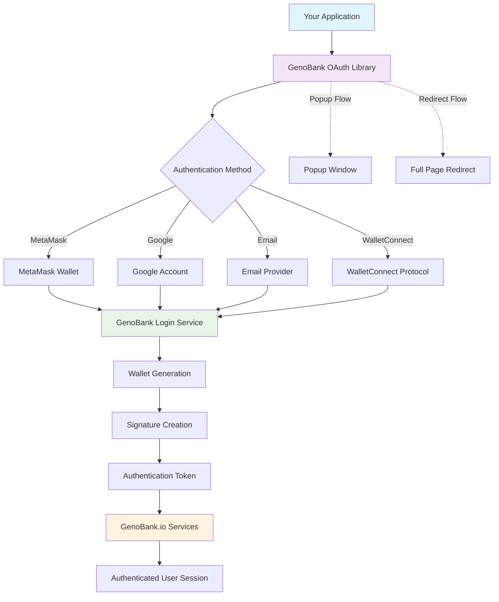

# GenoBank.io OAuth Library

## Overview

The GenoBank.io OAuth Library is a lightweight JavaScript solution that facilitates wallet generation and user authentication through popular services like MetaMask, Google Account, Email, and WalletConnect. This library acts as an intermediary between your applications and commonly used authentication services to generate a wallet and signature that GenoBank.io services will use for user authentication.

## Architecture Diagram



### Flow Description

1. **Integration**: Your application integrates the GenoBank OAuth Library
2. **User Action**: User clicks authentication button (custom or pre-built)
3. **Method Selection**: Library presents available authentication methods
4. **Provider Authentication**: User authenticates with chosen provider (MetaMask, Google, etc.)
5. **Wallet Generation**: GenoBank generates a secure wallet based on authentication
6. **Signature Creation**: A unique signature is created for the user
7. **Token Generation**: Authentication token is generated
8. **Service Access**: User gains access to GenoBank.io services with authenticated session

## How It Works

### Authentication Flow

The library simplifies the authentication process by:

1. **Service Integration**: Connects with multiple authentication providers (MetaMask, Google Account, Email, WalletConnect)
2. **Wallet Generation**: Creates a secure wallet based on the selected authentication method
3. **Signature Creation**: Generates a unique signature for GenoBank.io authentication
4. **Seamless Integration**: Provides easy-to-use methods for both popup and redirect authentication flows

### Query Parameters

The library automatically handles two essential encrypted base64 query parameters:

- **`isPopup`**: Determines whether the authentication is executed in a popup window or as a redirect, enabling appropriate logic for each scenario
- **`source`**: Identifies the origin of the user attempting to authenticate with GenoBank.io

> **Note**: You don't need to manually handle these parameters - they are automatically managed by the library.

## Installation

Include the library in your HTML file using the CDN:

```html
<script src="https://auth.genobank.app/genobank_oauth.min.js"
        integrity=""
        crossorigin="anonymous"></script>
```

## Usage

### Basic HTML Setup

```html
<!DOCTYPE html>
<html>
<head>
    <title>GenoBank OAuth Integration</title>
</head>
<body>
    <!-- Pre-built OAuth Button -->
    <div id="genobank-oauth-button"></div>
    
    <!-- Custom Popup Button -->
    <div>
        <button onclick="openPopup()">Custom Open Popup Button</button>
    </div>
    
    <!-- Redirect Button -->
    <div>
        <button onclick="redirectWithEncryptedData()">Redirect to GenoBank Login</button>
    </div>
    
    <!-- Logout Buttons -->
    <button onclick="logout()">Logout</button>
    <button onclick="logout(true)">Logout with Reload</button>
    
    <!-- Library Script -->
    <script src="https://auth.genobank.app/genobank_oauth.min.js"
            integrity="" 
            crossorigin="anonymous"></script>
</body>
</html>
```

## Available Functions

### 1. HTML Inner Button

The library automatically generates a pre-built authentication button when you include a div with the ID `genobank-oauth-button` in your HTML.

```html
<div id="genobank-oauth-button"></div>
```

**Features:**
- Automatically rendered by the library
- Built-in styling and functionality
- Limited customization options

**Use Case:** Quick implementation when custom styling is not required.

### 2. `openPopup()`

Opens the GenoBank authentication popup window with a custom button.

```javascript
function openPopup()
```

**Parameters:** None

**Features:**
- Can be assigned to any custom button
- Opens authentication in a popup window
- Maintains current page state

**Example:**
```html
<button onclick="openPopup()">Sign In with GenoBank</button>
```

### 3. `redirectWithEncryptedData()`

Redirects the user to the GenoBank login page with the necessary authentication data.

```javascript
function redirectWithEncryptedData()
```

**Parameters:** None

**Features:**
- Full page redirect to GenoBank authentication
- Automatically includes encrypted parameters
- Suitable for mobile or full-screen authentication flows

**Example:**
```html
<button onclick="redirectWithEncryptedData()">Login with GenoBank</button>
```

### 4. `logout(reload)`

Removes stored credentials from the browser.

```javascript
function logout(reload)
```

**Parameters:**
- `reload` (boolean, optional): 
  - `true`: Clears credentials and reloads the page
  - `false` or omitted: Clears credentials without reloading

**Examples:**
```javascript
// Logout without page reload
logout();

// Logout with page reload
logout(true);
```

## Authentication Methods Supported

The library supports authentication through:

- **MetaMask**: Web3 wallet authentication
- **Google Account**: OAuth integration with Google services
- **Email**: Traditional email-based authentication
- **WalletConnect**: Multi-wallet connection protocol

## Integration Examples

### React Integration

```jsx
import React, { useEffect } from 'react';

function AuthComponent() {
    useEffect(() => {
        // Load the script dynamically if needed
        const script = document.createElement('script');
        script.src = 'https://auth.genobank.app/genobank_oauth.min.js';
        script.crossOrigin = 'anonymous';
        document.head.appendChild(script);
    }, []);

    return (
        <div>
            <div id="genobank-oauth-button"></div>
            <button onClick={() => window.openPopup()}>
                Custom Authentication
            </button>
        </div>
    );
}
```

### Vue.js Integration

```vue
<template>
    <div>
        <div id="genobank-oauth-button"></div>
        <button @click="authenticate">Custom Login</button>
    </div>
</template>

<script>
export default {
    mounted() {
        const script = document.createElement('script');
        script.src = 'https://auth.genobank.app/genobank_oauth.min.js';
        script.crossOrigin = 'anonymous';
        document.head.appendChild(script);
    },
    methods: {
        authenticate() {
            if (window.openPopup) {
                window.openPopup();
            }
        }
    }
}
</script>
```

## Best Practices

1. **Choose the Right Method**: Use `openPopup()` for better UX when you want to keep the user on the current page, and `redirectWithEncryptedData()` for mobile-friendly full-screen authentication.

2. **Error Handling**: Always implement proper error handling around authentication calls.

3. **Security**: The library automatically handles encryption and secure parameter passing - avoid manually manipulating these values.

4. **Testing**: Test both popup and redirect flows across different devices and browsers.

## Browser Compatibility

The library is compatible with:
- Chrome 60+
- Firefox 55+
- Safari 12+
- Edge 79+

## Support

For technical support, integration questions, or bug reports, please contact the GenoBank.io development team or refer to the official documentation.

## License

Please refer to GenoBank.io's terms of service and licensing agreement for usage rights and restrictions.